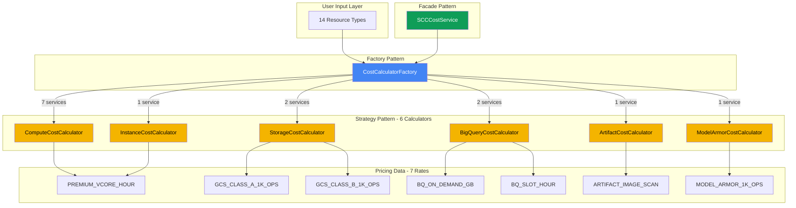

# SCC Calculator - Architecture Documentation

## Overview

The SCC Cost Calculator uses an object-oriented architecture based on **Design Patterns** to efficiently calculate costs for 14 different Google Cloud services using only 6 calculator classes and 7 billing rates.

---

## Architecture Diagram



---

## Service → Calculator Mapping

### ComputeCostCalculator (7 services)
**Formula:** `vCPUs × hours × PREMIUM_VCORE_HOUR`

- ✅ Compute Engine
- ✅ GKE Standard
- ✅ GKE Autopilot  
- ✅ Cloud SQL
- ✅ App Engine Flex
- ✅ Dataflow
- ✅ Dataproc

### InstanceCostCalculator (1 service)
**Formula:** `instances × hours × PREMIUM_VCORE_HOUR`

- ✅ App Engine Standard

### StorageCostCalculator (2 services)
**Formula:** `(operations ÷ 1000) × rate`

- ✅ Cloud Storage Class A → `GCS_CLASS_A_1K_OPS`
- ✅ Cloud Storage Class B → `GCS_CLASS_B_1K_OPS`

### BigQueryCostCalculator (2 services)
**Formulas:**
- On-Demand: `GB × BQ_ON_DEMAND_GB`
- Capacity: `slots × hours × BQ_SLOT_HOUR`

- ✅ BigQuery (On-Demand Analysis)
- ✅ BigQuery (Capacity/Slots)

### ArtifactCostCalculator (1 service)
**Formula:** `images × ARTIFACT_IMAGE_SCAN`

- ✅ Artifact Registry (Scanning)

### ModelArmorCostCalculator (1 service)
**Formula:** `(ops_1k × 1000) × MODEL_ARMOR_1K_OPS`

- ✅ Model Armor (GenAI Security)

---

## Pricing Rates Structure

The `scc_rates.json` file contains **7 billing rates**, not 14 individual service prices:

```json
{
  "project": {
    "PREMIUM_VCORE_HOUR": 0.0071,      // Used by 8 services
    "GCS_CLASS_A_1K_OPS": 0.002,        // Cloud Storage Class A
    "GCS_CLASS_B_1K_OPS": 0.0002,       // Cloud Storage Class B
    "BQ_ON_DEMAND_GB": 0.00098,         // BigQuery On-Demand
    "BQ_SLOT_HOUR": 0.00548,            // BigQuery Capacity
    "ARTIFACT_IMAGE_SCAN": 0.20,        // Artifact Registry
    "MODEL_ARMOR_1K_OPS": 0.0001        // Model Armor
  },
  "org": { /* Same structure, different rates (Org-level discount) */ }
}
```

---

## Design Patterns Used

### 1. **Strategy Pattern**
Each calculator implements the `ICostCalculator` interface:
```typescript
interface ICostCalculator {
  calculate(resource: ResourceInput, rates: BaseRates): number;
}
```

### 2. **Factory Pattern**
`CostCalculatorFactory` instantiates the correct calculator based on resource type:
```typescript
CostCalculatorFactory.create(ResourceType.COMPUTE_ENGINE)
  → new ComputeCostCalculator()
```

### 3. **Facade Pattern**
`SCCCostService` provides a simple interface for complex calculation logic:
```typescript
SCCCostService.calculate(resources, pricingRates, contactSalesText)
  → CostResult
```

---

## Benefits of This Architecture

### ✅ **DRY (Don't Repeat Yourself)**
- 7 services share `ComputeCostCalculator` logic
- Only 7 rates for 14 services

### ✅ **Maintainability**
- Change vCPU pricing → Update `PREMIUM_VCORE_HOUR` → Affects 8 services automatically
- Add new vCPU-based service → Add 1 line to Factory switch

### ✅ **Testability**
- Each calculator is a pure function
- Easy to unit test independently
- 31 test cases cover all scenarios

### ✅ **Extensibility**
- New service type → Create new calculator class
- New pricing tier → Add to `scc_rates.json`

---

## Example: Adding a New Service

Suppose Google launches "Cloud Run Premium". To add it:

1. **Update Enum** (`src/types/index.ts`):
```typescript
export enum ResourceType {
  // ...
  CLOUD_RUN_PREMIUM = 'Cloud Run Premium'
}
```

2. **Update Factory** (`src/services/calculators/CostCalculatorFactory.ts`):
```typescript
case ResourceType.CLOUD_RUN_PREMIUM:
  return new ComputeCostCalculator(); // Uses existing calculator
```

3. **Done!** No new calculator needed if it uses vCPUs.

---

## File Structure

```
src/
├── services/
│   ├── calculators/
│   │   ├── ICostCalculator.ts          # Interface (Strategy)
│   │   ├── ComputeCostCalculator.ts    # vCPU-based services
│   │   ├── InstanceCostCalculator.ts   # Instance-based services
│   │   ├── StorageCostCalculator.ts    # GCS operations
│   │   ├── BigQueryCostCalculator.ts   # BigQuery modes
│   │   ├── ArtifactCostCalculator.ts   # Container scanning
│   │   ├── ModelArmorCostCalculator.ts # GenAI security
│   │   ├── CostCalculatorFactory.ts    # Factory Pattern
│   │   └── __tests__/                  # Unit tests (7 files)
│   ├── SCCCostService.ts               # Facade Pattern
│   └── pricingApi.ts                   # Pricing data loader
├── data/
│   └── scc_rates.json                  # 7 billing rates (project + org)
└── types/
    └── index.ts                        # TypeScript interfaces
```

---

## Testing

Run the test suite to verify all calculations:

```bash
npm test                # Run all tests once
npm run test:watch      # Watch mode (development)
npm run test:ui         # Interactive UI (Vitest UI)
```

**Coverage:**
- 7 test files
- 31 test cases
- All calculator strategies
- Edge cases (undefined, zeros, thresholds)

---

## CI/CD Protection

GitHub Actions runs tests on every PR:
- Tests must pass before merge to `main`
- See `.github/workflows/ci.yml`
- Branch protection configured (see `.github/BRANCH_PROTECTION.md`)
