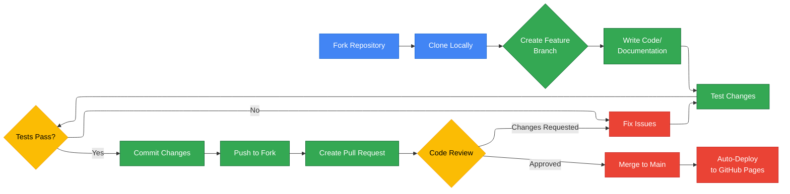

# Contributing to SCC Cost Calculator

*   **Author:** JuanK Ruiz
*   **Date:** January 20, 2026
*   **Subject:** Contribution Guidelines for SCC Cost Calculator
*   **References:** [FAQ.md](FAQ.md), [README.md](README.md)
*   **Status:** Living Document
*   **Version:** v1.0

---

## Executive Summary

The SCC Cost Calculator welcomes contributions from developers, architects, partners, and end-users at all skill levels. Non-technical contributions (documentation, testing, translations) are equally valued as code contributions. This guide outlines how to get started, the development workflow, code standards, and the submission process. All contributions must be licensed under CC BY 4.0 to maintain project consistency.

---

First off, thank you for considering contributing to the SCC Cost Calculator! 🎉

This project is a community-driven effort to provide fast, accurate cost estimates for Google Cloud Security Command Center (SCC) deployments. Whether you're a developer, architect, partner, or end-user, there are many ways to contribute.

## Table of Contents

- [Code of Conduct](#code-of-conduct)
- [How Can I Contribute?](#how-can-i-contribute)
- [Getting Started](#getting-started)
- [Development Workflow](#development-workflow)
- [Submitting Changes](#submitting-changes)
- [Style Guidelines](#style-guidelines)
- [License Agreement](#license-agreement)

## Code of Conduct

This project adheres to a simple principle: **be respectful and constructive**. We welcome contributors from all backgrounds and skill levels. If you encounter any issues with conduct, please reach out to the maintainers.

## How Can I Contribute?

### 💡 Non-Technical Contributions (No Coding Required!)

You **don't need to be a developer** to add significant value:

1. **Validate Calculations**
   - Test estimates against real-world GCP bills
   - Report discrepancies or edge cases
   - Share anonymized scenarios for testing

2. **Improve Documentation**
   - Fix typos or unclear explanations
   - Translate content (we support ES, EN, PT)
   - Create tutorials or video walkthroughs
   - Enhance the FAQ with common questions

3. **Feature Requests**
   - Suggest new resource types to support
   - Propose UI/UX improvements
   - Share partner pain points that could be solved

4. **Quality Assurance**
   - Test on different browsers and devices
   - Report bugs with detailed reproduction steps
   - Verify accessibility standards

### 💻 Technical Contributions

If you're a developer, we'd love your help with:

1. **Code Improvements**
   - Add support for new GCP resource types
   - Optimize performance
   - Improve error handling
   - Enhance mobile responsiveness

2. **Testing**
   - Write unit tests
   - Create integration tests
   - Improve test coverage

3. **Infrastructure**
   - Optimize build process
   - Improve deployment pipeline
   - Enhance CI/CD workflows

4. **Data Updates**
   - Update pricing data from official sources
   - Scrape/automate pricing updates
   - Validate pricing accuracy

## Getting Started

### Prerequisites

- **Node.js**: Version 18.0.0 or higher
- **npm**: Version 9+ (comes with Node.js)
- **Git**: For version control
- A modern web browser

### Local Development Setup

1. **Fork and Clone**
   ```bash
   git clone https://github.com/your-username/scc-cost-calculator.git
   cd scc-cost-calculator
   ```

2. **Install Dependencies**
   ```bash
   npm install
   ```

3. **Start Development Server**
   ```bash
   npm run dev
   ```
   
   The app will be available at `http://localhost:5173`

4. **Make Your Changes**
   - Create a feature branch: `git checkout -b feature/your-feature-name`
   - Make your changes
   - Test thoroughly

5. **Build for Production (Optional)**
   ```bash
   npm run build
   npm run preview
   ```

## Development Workflow

### Project Structure

```
scc-cost-calculator/
├── src/
│   ├── components/     # React components (InputRow, CostCharts, etc.)
│   ├── context/        # React context providers (Language)
│   ├── data/           # Static data (pricing rates JSON)
│   ├── i18n/           # Translations (ES, EN, PT)
│   ├── services/       # Business logic (pricing API)
│   ├── types/          # TypeScript type definitions
│   ├── App.tsx         # Main application component
│   └── index.tsx       # Application entry point
├── index.html          # HTML template
├── package.json        # Dependencies and scripts
├── tsconfig.json       # TypeScript configuration
├── vite.config.ts      # Vite build configuration
└── README.md           # Project documentation
```

### Contribution Flow Diagram

The following diagram illustrates the typical contribution workflow:



###  Key Files to Know

- **`src/data/scc_rates.json`**: Official SCC pricing data
- **`src/types/index.ts`**: TypeScript interfaces for resources and pricing
- **`src/App.tsx`**: Main cost calculation logic
- **`src/i18n/translations.ts`**: All UI text translations

### Adding a New Resource Type

1. Add the resource type to `ResourceType` enum in `src/types/index.ts`
2. Update the cost calculation logic in `src/App.tsx` (`calculateCosts` function)
3. Add pricing rates to `src/data/scc_rates.json`
4. Update `InputRow.tsx` to handle the new resource's input fields
5. Add translations in `src/i18n/translations.ts`
6. Test with demo data

### Updating Pricing Data

1. Visit the [official GCP SCC pricing page](https://cloud.google.com/security-command-center/pricing)
2. Update rates in `src/data/scc_rates.json`
3. Update `lastUpdated` field with current date
4. Test calculations to ensure accuracy
5. Document changes in your PR

## Submitting Changes

### Pull Request Process

1. **Update Documentation**
   - Update README.md if adding features
   - Update FAQ.md for common questions
   - Add code comments for complex logic

2. **Test Your Changes**
   - Verify the app builds: `npm run build`
   - Test in multiple browsers
   - Check responsiveness on mobile

3. **Commit Guidelines**
   - Use clear, descriptive commit messages
   - Follow conventional commits format:
     ```
     feat: Add support for Cloud Run resources
     fix: Correct BigQuery slot calculation
     docs: Update FAQ with pricing source info
     ```

4. **Create Pull Request**
   - Provide a clear description of changes
   - Reference any related issues
   - Include screenshots for UI changes
   - Explain testing performed

5. **Code Review**
   - Address reviewer feedback promptly
   - Keep discussions professional and constructive
   - Don't be afraid to ask questions!

### What to Expect

- **Review Time**: Most PRs are reviewed within 3-5 business days
- **Feedback**: Expect constructive feedback and suggestions
- **Iteration**: Be prepared to make revisions
- **Merge**: Once approved, maintainers will merge your PR

## Style Guidelines

### Code Style

- **TypeScript**: Strict mode enabled
- **Formatting**: We use ESLint and Prettier (run `npm run lint`)
- **Naming**: 
  - Components: PascalCase (`InputRow.tsx`)
  - Functions: camelCase (`calculateCosts`)
  - Constants: UPPER_SNAKE_CASE (`PREMIUM_VCORE_HOUR`)

### UI/UX Guidelines

- **Accessibility**: Ensure ARIA labels and keyboard navigation
- **Responsive**: Test on mobile, tablet, and desktop
- **Performance**: Keep bundle size small
- **Internationalization**: All user-facing text must be translatable

### Git Commit Messages

- Use present tense ("Add feature" not "Added feature")
- Capitalize first letter
- No period at the end
- Reference issues: `Fixes #123`

## License Agreement

By contributing to this project, you agree that your contributions will be licensed under the **Creative Commons Attribution 4.0 International License (CC BY 4.0)**.

This means:
- ✅ Anyone can use, share, and adapt your contributions
- 📝 With proper attribution to the original author
- 🌍 For commercial or non-commercial purposes

See the [LICENSE](LICENSE) file for full details.

---

## Questions?

- **General Questions**: Check the [FAQ](FAQ.md)
- **Technical Issues**: [Open an issue](https://github.com/JuanKRuiz/SCC-Calculator/issues)
- **Contact**: [LinkedIn - JuanK Ruiz](https://www.linkedin.com/in/juankruiz/)

Thank you for helping make SCC cost estimation faster and more accessible for everyone! 🚀
