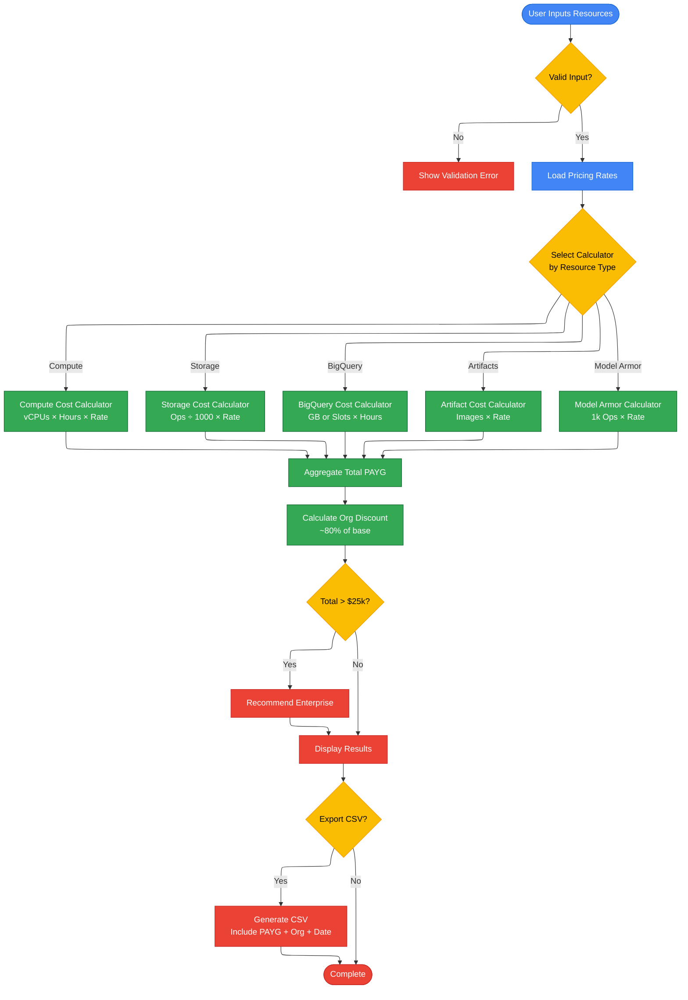

# SCC Cost Calculator - Frequently Asked Questions (FAQ)

*   **Author:** JuanK Ruiz
*   **Date:** January 20, 2026
*   **Subject:** SCC Cost Calculator - Frequently Asked Questions
*   **References:** [Google Cloud SCC Pricing](https://cloud.google.com/security-command-center/pricing), [GitHub Repository](https://github.com/JuanKRuiz/SCC-Calculator)
*   **Status:** Living Document
*   **Version:** v1.0

---

## Table of Contents

1. [Executive Summary](#1-executive-summary)
2. [About the Tool](#2-about-the-tool)
3. [Contributing](#3-contributing)
4. [Privacy & Security](#4-privacy--security)
5. [Technical Details](#5-technical-details)
6. [Licensing](#6-licensing)
7. [Contact & Support](#7-contact--support)

---

## 1. Executive Summary

This FAQ addresses common questions about the **SCC Cost Calculator**, an open-source tool designed to estimate Google Cloud Security Command Center (SCC) Premium costs. The calculator runs entirely in the browser (zero backend), ensuring complete data privacy while providing fast, accurate cost projections for architects and CISO teams. It supports all major SCC Premium resource types including Compute Engine, GKE, BigQuery, and Model Armor. Contributions are welcome from both technical and non-technical community members.

---

## 2. About the Tool

### 2.1. What makes this calculator different from official tools and internal dashboards?
While internal solutions like PLX are excellent for auditing already-deployed resources, their closed nature and latency limit the agility needed in initial design phases. This proactive accelerator eliminates SSO as a barrier to entry for partners 💡

The calculator was built to bridge the gap between conceptual architecture and cost estimation, allowing partners to iterate quickly without waiting for infrastructure provisioning or complex authentication workflows.

### 2.2. Why was this built as a client-side web application?
**Architecture and Efficiency**: The app is lightweight and runs entirely in the browser, leveraging modern web development techniques to avoid the need for robust VMs. It currently runs on GitHub Pages at no cost, making it fast and accessible from anywhere without requiring heavy infrastructure 🥳

This design choice ensures:
- **Zero server costs**: No backend to maintain or scale
- **Instant availability**: No deployment pipelines or downtime
- **Universal access**: Works on any device with a modern browser
- **Complete privacy**: All calculations happen locally (see Privacy section)

### 2.3. Who owns the roadmap for this tool?
**Collective Ownership and Roadmap**: As an OSS (Open Source Software) resource, the roadmap doesn't belong to me alone. The idea is for the community to contribute their knowledge so that the calculation logic becomes the speed standard in the ecosystem... the evolution of the tool is defined by all of us based on real problems detected in the field 🛠️

The open-source model ensures:
- Community-driven feature prioritization
- Rapid bug fixes and improvements
- Diverse perspectives from field experience
- Transparency in calculation logic

## 3. Contributing

### 3.1. Do I need to know how to code to contribute?
**Contributions and Profiles**: The invitation is open to the entire team, and knowing how to program is NOT a requirement to add value to the accelerator. You can contribute by:

- ✅ Validating the accuracy of calculations against real cases
- ✅ Suggesting new functionalities based on partner needs
- ✅ Helping to document processes and best practices
- ✅ Reporting bugs or inconsistencies
- ✅ Improving translations (ES, EN, PT)
- ✅ Testing in different scenarios and environments 🙂

For code contributions, please see our [CONTRIBUTING.md](CONTRIBUTING.md) guide.

## 4. Privacy & Security

### 4.1. Is my data private when using this calculator?
**Data Privacy**: The calculator operates under a client-side execution model. **No sensitive data about the partner's architecture leaves the browser,** ensuring that information remains private and secure at all times 💡

Technical details:
- All calculations are performed in JavaScript within your browser
- No data is sent to external servers or APIs
- No analytics or tracking is implemented
- Resource configurations never leave your device
- The tool can be used completely offline (after initial page load)

### 4.2. Where does the pricing data come from?
Pricing rates are embedded in the application code and sourced from the official [Google Cloud Security Command Center Pricing page](https://cloud.google.com/security-command-center/pricing). The effective date of the pricing data is displayed in the header and included in CSV exports.

**Important**: While we strive to keep pricing current, always verify with official Google Cloud documentation before making business decisions. The calculator provides estimates, not contractual quotes.

## 5. Technical Details

### 5.1. What technologies power this calculator?
- **Frontend Framework**: React 19 with TypeScript
- **Build Tool**: Vite (fast, modern bundler)
- **Styling**: Tailwind CSS (utility-first CSS framework)
- **Icons**: Lucide React
- **Charts**: Recharts (for cost visualizations)
- **Internationalization**: Custom i18n context (ES, EN, PT)

### 5.2. How accurate are the cost estimates?
The calculator uses official Google Cloud pricing rates and follows SCC Premium tier billing logic. However:

- ⚠️ Estimates are for **planning purposes only**
- ⚠️ Actual costs may vary based on:
  - Regional pricing differences
  - Custom contract terms (EDPs, committed use discounts)
  - Promotional credits or special offers
  - Changes in usage patterns

Always consult with your Google Cloud account team for precise quotes.

### 5.3. What SCC Premium resource types are supported?
The calculator currently supports:

**Compute/Workload Resources (vCore-based):**
- Compute Engine
- GKE Standard & Autopilot
- Cloud SQL
- App Engine Flex
- Dataflow
- Dataproc

**Instance-based:**
- App Engine Standard

**Storage:**
- Cloud Storage (Class A & B Operations)

**Data Processing:**
- BigQuery (On-Demand Analysis)
- BigQuery (Capacity/Slots)

**Artifacts:**
- Artifact Registry (Container Scanning)

**GenAI Security:**
- Model Armor (GenAI Security)

### 5.5. How does the cost calculation work?

The following diagram illustrates the cost calculation flow:

### 5.4. How can I request support for new resource types?
Open an issue on the [GitHub repository](https://github.com/JuanKRuiz/SCC-Calculator) with:
- Resource type name
- Official pricing documentation link
- Use case description
- Expected calculation logic

## 6. Licensing

### 6.1. What license does this project use?
This project is licensed under the **Creative Commons Attribution 4.0 International License (CC BY 4.0)**.

This means you are free to:
- ✅ Share: copy and redistribute the material
- ✅ Adapt: remix, transform, and build upon the material
- ✅ Use commercially

Under the following terms:
- 📝 **Attribution**: You must give appropriate credit to the original author

See the full [LICENSE](LICENSE) file for details.

## 7. Contact & Support

### 7.1. Where can I report bugs or request features?
- **GitHub Issues**: [Report bugs or request features](https://github.com/JuanKRuiz/SCC-Calculator/issues)
- **LinkedIn**: [Connect with JuanK Ruiz](https://www.linkedin.com/in/juankruiz/)

### 7.2. How often is the pricing data updated?
We aim to update pricing data within 30 days of any official Google Cloud pricing changes. The current pricing effective date is always displayed in the app header and CSV exports.

To check for updates or contribute pricing updates, visit the [GitHub repository](https://github.com/JuanKRuiz/SCC-Calculator).
